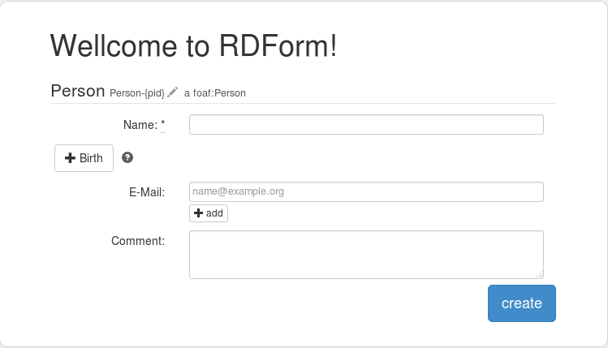

# RDForm #

RDForm is a jQuery plugin for creating and editing RDF data in a clean and modern HTML form.

With templates based on the [RDFa](https://en.wikipedia.org/wiki/RDFa) notation (see template documentation) its easy to create classes, properties with datatypes, resources and class-relations.

The inserting of existing data and the output is done as a JavaScript object with the [JSON-LD](https://github.com/digitalbazaar/jsonld.js) notation.

> This software is currently in a very early state. Please be careful when use it in a productive environment.

## Screenshot ##



## Installation ##

* download the source code
* open [index.html](index.html) in your browser for a sample form.
* to create a own form edit [templates/form.html](templates/form.html) to your requirements or create a new

If you want to integrate RDForm into an existing project you have to include [jQuery](http://jquery.com/) (> 1.8) (and for a good style [Bootstrap](getbootstrap.com/)). Have a look at [index.html](index.html) for the right structure.

The basic initialization of the plugin with callback function on submit is:

```js
$(document).ready(function(){
	$(".rdform").RDForm({
		template: "templates/form.html",

        submit: function() {
            console.log( JSON.stringify(this, null, '\t') );
        }
	});
});
```

# Documentation #

### Content ###

- Parameter
- Template Documentation
	- Classes
	- Literal-Properties
	- Class-Resources
	- External resources
	- Hidden-Properties
	- Wildcards
	- Translation
- Data inserting
- Hooking

## Paramter ##

The following parameters can given to the plugin:

Parameter  | Description
------------- | -------------
template  	| Path to the template file
data  		| Array or Object of existing data to insert
hooks 		| Path to the hooks file
lang 		| Path to the language file
cache 		| true or false, loads template from cache
verbose 	| true or false, output messages before the form 
debug 		| log error, warnings and infos into the console
submit 		| Submit callback function


## Template Documentation ##

To visualize a class, its properties and the resources in a form the plugin needs a template. The templates are based on the [RDFa](https://en.wikipedia.org/wiki/RDFa) notation which adds RDF attributes to HTML elements. With that kind of templates its possible to describe RDF-ontologies on the HTML-way and to define the layout like labels, legends, placeholder and so on.

Some default templates can by found in the subfolder [templates](templates/). The path of the current template must be given as `model` argument to the plugin (see installation).

The base structure of an example template is:

```html
<form prefix="foaf http://xmlns.com/foaf/0.1/ rdfs http://www.w3.org/2000/01/rdf-schema#">
	<legend>A person</legend>
	<div typeof="foaf:Person" resource="Person-{rdfs:label}">
		<label>The label</label>
		<input name="rdfs:label" datatype="xsd:string" />
	</div>
</form>
```

The JavaScript output for this template will be:

```js
{
	"@id": "Person-Max_Mustermann",
	"@type": [
		"http://xmlns.com/foaf/0.1/Person"
	],
	"http://www.w3.org/2000/01/rdf-schema#name": [
		{
			"@type": "xsd:string",
			"@value": "Max Mustermann"
		}
	]
}
```

### Classes ###

Classes are described by a `<div typeof="...">...</div>` tag.

Attribute  | Description
------------- | -------------
`typeof`  	| Type of the class
`resource`  | Class uri
`id`		| Optional class ID to reference classes with same typeof

Example:

```html
<div typeof="bio:Birth" resource="Birth-123">
	...
</div>
```

### Literal properties ###

Literals are described by a `<input type="literal" name="..." />`.

Attribute  | Description
------------- | -------------
`type="literal"`  	|  Defines an input as an literal property
`name`  			| Name of the property

Optional Attribute  | Description
------------- | -------------
`datatype`  	| Datatype, e.g. xsd:string, xsd:date,
`value`  		| Prefixed value
`placeholder`  	| Placeholder
`multiple`  	| The property can be multipled by clicking an add-button
`required`  	| Required property, cannot be empty
`additional`  	| Additional, by default hidden property. Can be added it by clicking an add-button
`readonly`  	| Cannot be edited
'hidden'		| Hide this literal in the form
`help`  		| Short help text for the property

Example:

```html
<input type="literal" name="foaf:firstName" datatype="xsd:string" required placeholder="Name..." help="The name of the person" />
```

Special literals are booleans, textareas and select-lists.

#### Booleans

Are described as checkboxes in the form and can be 1|0 or true|false. They are initialized by adding the attribute `boolean` to a literal property.

#### Textareas

Are more line texts and initialized by adding the attribute `textarea` to a literal property.

#### Select lists

To get a select list add the attributes `select` and `select-options='...'`. the value of `select-options` must be a [JSON](https://en.wikipedia.org/wiki/JSON) object with a label and value pair.

Example:

```html
<input name="foaf:gender" type="literal" select select-options='{"woman":"woman", "man":"man"}'  datatype="xsd:string" />
```

### Class resources ###

Classes can contain resource properties, which containing a reference to another class.

Example:

```html
<div typeof="foaf:Person" resource="Person-{pid}">
	<input name="pid" type="hidden" />
	<input name="bio:event" type="resource" value="bio:Birth"
      arguments='{"pid":"{pid}"}' additional
    />
</div>

<div typeof="bio:Birth" resource="Birth-{pid}">
	<input name="dc:date" type="literal" datatype="xsd:date" placeholder="JJJJ-MM-TT" />
</div>
```

### External resources ###

Example:

```html
<input type="resource" name="gnd" external />
```

## Hidden properties ##

Example:

```html
<input type="hidden" name="id" />
```

### Wildcards ###

With wildcards the class identifier or a property value can point to another property value of the same class. Just write the name of the property into brackets.

Example:

```html
	<div typeof="Person" resource="Person-{id}">
		<input name="id" type="hidden" value="{label}-123" />
		<input name="label" type="literal" />
	</div>
```


### Translation ###

Strings in legends, labels and placeholder can translated with `l(My Label)`. The translation files are stored in [lang/](lang/) (currently only english and german) and must be given as `lang` argument to the plugin.

Example:

```js
$(".rdform").RDForm({
	template: "templates/form.html",
	lang: "de"
});
```

## Data inserting ##

Example:

```js
var data = {
	"@id": "http://json-ld.org/playground/Person-Karl",
	"@type": [
      "http://xmlns.com/foaf/0.1/Person"
    ],
    "http://xmlns.com/foaf/0.1/name": [
      {
        "@type": "xsd:string",
        "@value": "Karl"
      }
    ]
};

$(".rdform").RDForm({
	template: "templates/form.html",
	data: data
});
```

## Hooking ##

With hooks own JavaScript methods can affect the application execution on certain points. Have a look at [js/hooks/hooks.js](js/hooks/hooks.js) for more information.


## License ##

OntoWiki is licensed under the [GNU General Public License Version 2, June 1991](http://www.gnu.org/licenses/gpl-2.0.txt).